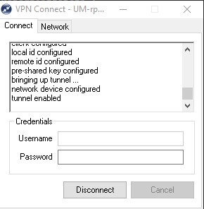
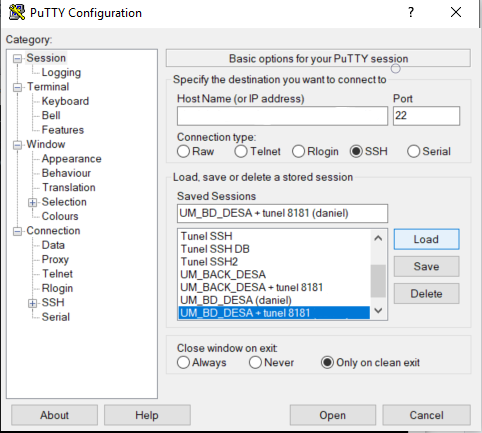
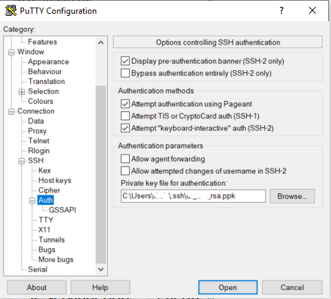
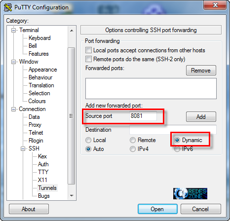
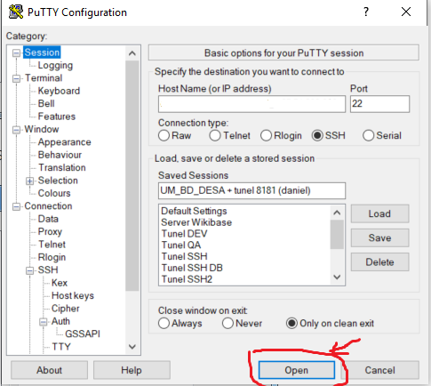
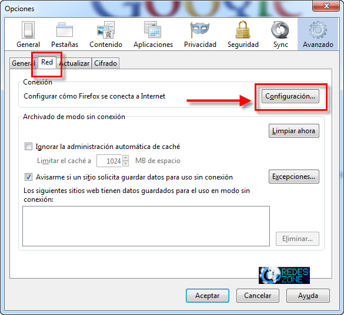
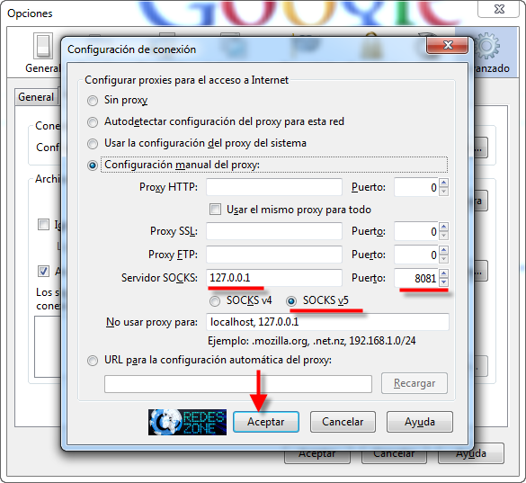
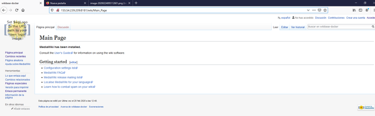

| Entregable | Documentación sobre el despliegue                            |
| ---------- | ------------------------------------------------------------ |
| Fecha      | 17/12/2020                                                   |
| Proyecto   | [ASIO](https://www.um.es/web/hercules/proyectos/asio) (Arquitectura Semántica e Infraestructura Ontológica) en el marco de la iniciativa [Hércules](https://www.um.es/web/hercules/) para la Semántica de Datos de Investigación de Universidades que forma parte de [CRUE-TIC](https://www.crue.org/proyecto/hercules/) |
| Módulo     | Arquitectura Semántica                                       |
| Tipo       | Documento                                                    |
| Objetivo   | Despliegue en entorno de desarrollo para la Universidad de Murcia |
| Estado     | 100%                                         |
| Próximos pasos | Actualizar de forma acorde al avance del proyecto y surjan necesidades.    


# Despliegue en entorno de desarrollo para la Universidad de Murcia
---

## Entornos 

### Hardware  

| Nombre | herc-iz-front-desa.atica.um.es | herc-iz-back-desa.atica.um.es | herc-iz-bd-desa.atica.um.es |
|---|---|---|---|
| **IP**  | 155.54.239.207  | 155.54.239.208  | 155.54.239.209 |
| **SO**  | CentOS Linux release 7.7.1908  | CentOS Linux release 7.7.1908  | CentOS Linux release 7.7.1908  |
| **MEMORIA** | 16GB  | 32GB  | 16GB |
| **PROCESADOR** | Intel Core i7 9xx (Nehalem Class Core i7)  | Intel Core i7 9xx (Nehalem Class Core i7)  | Intel Core i7 9xx (Nehalem Class Core i7) |
| **CORES** | 4  | 8  | 4 |
| **ARQUITECTURA** | 64  | 64  | 64 |
| **PUERTOS** | 22, 80, 55555, 3030, 8081, 8070, 80, 81, 8080, 9321, 9326 | 22, 9321 | 22, 80, 8282, 8181, 3030 |

### Usuario

Se crea el usuario **herculesizertis** en todos los entornos para realizar tareas de despliegue y gestión.

## Instalaciones

### Docker

Instalar dependencias   

```
sudo yum install -y yum-utils device-mapper-persistent-data lvm2
```

Añadir repositorio   

```
sudo yum-config-manager --add-repo https://download.docker.com/linux/centos/docker-ce.repo
```

Instalar docker-ce   

```
sudo yum install docker-ce
```

Añadir el usuario actual el grupo docker   

```
sudo usermod -aG docker $(whoami)
```

Configurar el servicio Docker para comenzar automáticamente en cada reinicio   
```
sudo systemctl enable docker.service
```

Arrancar servicio  

```
sudo systemctl start docker.service
```

También es interesante modificar el driver de logging de docker para que no crezca indiscriminadamente. Para ello se modificará el fichero `/etc/docker/daemon.json`.

```json
{
  "log-driver": "json-file",
  "log-opts": {
    "max-size": "10m",
    "max-file": "3"
  }
}
```

### Crear usuario   

Crear grupo de usuario   

```
sudo groupadd herculesizertis
```

Crear  usuario **herculesizertis**  

```
sudo useradd -g herculesizertis  -d /home/herculesizertis -m -p h3rcul3s1z3rt1s herculesizertis
```

Añadir grupos **herculesizertis**  

```
sudo usermod -a -G sistemas herculesizertis
sudo usermod -a -G docker herculesizertis
```

Cambiar el grupo  

```
sudo usermod -a -G sistemas herculesizertis
sudo usermod -a -G docker herculesizertis
```

Dar los permisos a usuario  

```
usermod -a -G wheel herculesizertis
```

Cambiar de usuario   

```
su herculesizertis
```

Dar los permisos a usuario  

```
usermod -a -G wheel herculesizertis
```

Cambiar grupo principal

```
newgrp docker
```

### Instalar docker-compose   

Actualizar

```
yum update -y
```

Instalar dependencias

```
sudo yum install epel-release
```

Instalar Python y gcc

```
sudo yum install -y python-pip python-devel gcc
```

Actualizar python

```
 sudo yum upgrade python*
```

Actualizar pip

```
sudo pip install --upgrade pip
```

Instalar docker-compose

```
sudo pip install docker-compose
```

Comprobar instalacion

```
docker-compose version
```

### Actualización vm.max_map_count

Elasticsearch precisa que el valor de la variable `vm.max_map_count` sea de al menos 262144, para ello se precisa ejecutar el siguiente comando:

```
sudo sysctl -w vm.max_map_count=262144
```

## Despliegue  

Se indica a continuación los elementos desplegados por cada máquina.

### Máquina base de datos herc-iz-bd-desa.atica.um.es

La máquina de base de datos será la encargada de alojar todo lo que se refiere a persistencia de información. Los servicios desplegados son:

* **MariaDB**
  * Nombre del servicio: mariadb
  * Puertos: 3306
  * Descripción: base de datos MariaDB
* **Mongo**
  * Nombre del servicio: mongodb
  * Puertos: 27017
  * Descripción: base de datos MongoDB
* **Kafka**
  * Nombre del servicio: kafka
  * Puertos: 9092, 29092 (disponible desde el exterior)
  * Descripción: Servicio de Kafka
* **Zookeeper**
  * Nombre del servicio: zookeeper
  * Puertos: 2181
  * Descripción: Zookeeper para Kafka
* **Elasticsearch**
  * Nombre del servicio: elasticsearch
  * Puertos: 9200, 9300
  * Descripción: Servicio de búsquedas Elasticsearch
* **Kafdrop**
  * Nombre del servicio: kafdrop
  * Puertos: 19000
  * Descripción: Monitor de Kafka
* **Fuseki**
  * Nombre del servicio: jena-fuseki
  * Puertos: 3030
  * Descripción: Fuseki
* **Wikibase Elasticsearch AS**
  * Nombre del servicio: wiki-as-elasticsearch
  * Puertos: 9202
  * Descripción: Elasticsearch para Wikibase Arquitectura Semántica
* **Wikibase Elasticsearch IO**
  * Nombre del servicio: wiki-io-elasticsearch
  * Puertos: 9202
  * Descripción: Elasticsearch para Wikibase Infraestructura Ontológica

### Máquina back herc-iz-back-desa.atica.um.es

La máquina de back será la encargada de alojar las aplicaciones y los procesos batch. Los servicios desplegados son:

* **Graylog**
  * Nombre del servicio: graylog
  * Puertos: 9000
  * Descripción: Servicio de monitorización
* **Input Processor**
  * Nombre del servicio: input-processor
  * Puertos: N/A
  * Descripción: Procesador de datos de entrada
* **Management system**
  * Nombre del servicio: management-system
  * Puertos: N/A
  * Descripción: Sistema de gestión, generación de RDF
* **URIs Generator**
  * Nombre del servicio: uris-generator
  * Puertos: N/A
  * Descripción: Generador de URIs
* **Discovery**
  * Nombre del servicio: discovery
  * Puertos: N/A
  * Descripción: Librería de descubrimiento
* **Trellis event processor**
  * Nombre del servicio: trellis-event-processor
  * Puertos: N/A
  * Descripción: Procesador de eventos para Trellis
* **Trellis storage adapter**
  * Nombre del servicio: trellis-storage-adapter
  * Puertos: N/A
  * Descripción: Adaptador para almacenamiento en Trellis
* **Wikibase event processor**
  * Nombre del servicio: wikibase-event-processor
  * Puertos: N/A
  * Descripción: Procesador de eventos para Wikibase
* **Wikibase storage adapter**
  * Nombre del servicio: wikibase-storage-adapter
  * Puertos: N/A
  * Descripción: Adaptador para almacenamiento en Wikibase
* **PDI**
  * Nombre del servicio: pdi
  * Puertos: 8080
  * Descripción: Pentaho Data Integration para proceso de transformación de datos ETL

Además se configuran los siguientes procesos batch vía crontab

* **Dataset importer**
  * Nombre del servicio: dataset-importer
  * Cron expression: */5 * * * *
  * Descripción: Importador de dataset de UM
* **CVN importer**
  * Nombre del servicio: cvn-importer
  * Cron expression: */10 * * * *
  * Descripción: Importador de CVN

####  Configuración de procesos batch

Para configurar los procesos batch se opta por la configuración mediante crontab. Para ello, desde el usuario que se desea ejecutar el proceso se deberá ejecutar el comando:

  crontab -e

Se deberá configurar mediante una cron expression la frecuencia de ejecución del proceso. Como sugerencia, será necesario moverse al directorio en el que se encuentra el script para que pueda acceder de forma relativa a los recursos necesarios.

Para configurar la expresión cron, existen herrameitas que lo facilitan como por ejemplo https://crontab-generator.org/

Por ejemplo, en caso de querer ejecutar cada 5 minutos:

```crontab
*/5 * * * * cd /home/herculesizertis/deploy/scripts && ./launch_dataset_importer.sh >/dev/null 2>&1
*/10 * * * * cd /home/herculesizertis/deploy/scripts && ./launch_cvn_importer.sh >/dev/null 2>&1

```

### Máquina front herc-iz-front-desa.atica.um.es

La máquina de front será la encargada de alojar las aplicaciones de frontal. Los servicios desplegados son:

* **Trellis**
  * Nombre del servicio: trellis
  * Puertos: 80
  * Descripción: Linked Data Platform (LDP)
* **Wikibase AS**
  * Nombre del servicio: wikibase
  * Puertos: 8181, 8282, 9191
  * Descripción: Wikibase Arquitectura Semántica
* **Keycloak**
  * Nombre del servicio: keycloak
  * Puertos: 8080
  * Descripción: Keycloak

## Anexo

### Conexión a los servicios desde entorno local

Los servicios desplegados solamente son visibles desde las máquinas de la red, pero no así desde la máquina local, aunque esta se encuentre conectada a la VPN. Para poder acceder a los servicios será preciso configurar un tunel SSH a los puertos de las aplicaciones. Los pasos a seguir son:

1. Configurar en el fichero /etc/hosts (en Windows C:\\Windows\\System32\\drivers\\etc\\hosts) los nombres herc-iz-bd-desa.atica.um.es y herc-iz-back-desa.atica.um.es para que resuelvan a la IP 127.0.0.1

  127.0.0.1	herc-iz-bd-desa.atica.um.es
  127.0.0.1	herc-iz-back-desa.atica.um.es

2. Configurar tunel SSH, accediendo mediante la IP a la máquina herc-iz-back-desa.atica.um.es (155.54.239.208):
  * **Kafdrop**: 
    * Túnel SSH: 19000 -> herc-iz-bd-desa.atica.um.es:19000
    * Acceso desde navegador: http://herc-iz-bd-desa.atica.um.es:19000/
    * Autenticación: no requiere
  * **MariaDB**: 
    * Túnel SSH: 3306 -> herc-iz-bd-desa.atica.um.es:3306
    * Autenticación: usuarios de base de datos
  * **Trellis**:
    * Túnel SSH: 80 -> herc-iz-front-desa.atica.um.es:80
    * Acceso desde navegador: http://herc-iz-front-desa.atica.um.es/
    * Autenticación: configurado WebAC, posible acceso con autenticación básica o token JWT obtenido de Keycloak
  * **Wikibase AS**:
    * Túnel SSH: 8181 -> herc-iz-front-desa.atica.um.es:8181
    * Acceso desde navegador: http://herc-iz-front-desa.atica.um.es:8181/
    * Autenticación: no es necesario para la visualización de datos
  * **Graylog**:
    * Túnel SSH: 9000 -> herc-iz-back-desa.atica.um.es:9000
    * Acceso desde navegador: http://herc-iz-back-desa.atica.um.es:9000/
    * Autenticación: es precisa, configurado usuario "admin"
  * **Keycloak**:
    * Tunel SSH: 8443 -> herc-iz-front-desa.atica.um.es:8443
    * Acceso desde navegador: https://herc-iz-front-desa.atica.um.es:8443
    * Autenticación: es necesaria

#### Obtención de token JWT

Para obtener el token JWT desde Keycloak, es puede hacer con Postman configurando los siguientes parámetros:

* Grant type: Authorization Code
* Callback URL: http://localhost:8082
* Auth URL: https://herc-iz-front-desa.atica.um.es:8443/auth/realms/asio/protocol/openid-connect/auth
* Access Token URL: https://herc-iz-front-desa.atica.um.es:8443/auth/realms/asio/protocol/openid-connect/token
* Client ID: trellis
* Client Secret: 7c950207-b369-4a33-bbf0-fe2c6ca59e9a
* Scope: openid
* State: 12345
* Client Authentication: Send as Basic Auth header

Una vez configurados estos datos, al obtener el token se pedirán los datos del usuario y se obtendrá el token JWT que será preciso utilizar para llamar a aquellas aplicaciones que lo precisen.

#### Windows

Para conectar desde windows a un servicio ubicado en el puerto 8181, es necesario establecer un tunel ssh de la siguiente forma:

1. Establecer conexión VPN con UM usando credenciales

   

2. Establecer túnel SSH con putty
  - Crear sesión con Putty

    

  - Añadir en la sesión la public key facilitada por la UM para el acceso

    

  - Crear tunel. En **Source Port** ponemos el puerto que vamos a utilizar para el túnel (por ejemplo el 8081), **destination** lo dejamos en blanco y en las opciones de abajo lo ponemos en **Dynamic** y en **AUTO**. Y luego seleccionamos ADD (para añadir la configuración)

    

   - Conectarnos al servidor ssh

     

   - Configurar navegador (firefox)
     - Opciones, Avanzado, Red 

       

     - Configurar el proxy. **Configuración Manual del Proxy**, **Servidor SOCKS: 127.0.0.1** y el **puerto 8081** (el que pusimos anteriormente), elegimos **SOCKS v5** (comprobado que funciona).

       

     - Comprobar

       

## Generar certificados autofirmados para pruebas

```bash
######################
# Become a Certificate Authority
######################

# Generate private key
openssl genrsa -des3 -out myCA.key 2048
# Generate root certificate
openssl req -x509 -new -nodes -key myCA.key -sha256 -days 825 -out myCA.pem

######################
# Create CA-signed certs
######################

NAME=mydomain.com # Use your own domain name
# Generate a private key
openssl genrsa -out $NAME.key 2048
# Create a certificate-signing request
openssl req -new -key $NAME.key -out $NAME.csr
# Create a config file for the extensions
>$NAME.ext cat <<-EOF
authorityKeyIdentifier=keyid,issuer
basicConstraints=CA:FALSE
keyUsage = digitalSignature, nonRepudiation, keyEncipherment, dataEncipherment
subjectAltName = @alt_names
[alt_names]
DNS.1 = $NAME # Be sure to include the domain name here because Common Name is not so commonly honoured by itself
DNS.2 = bar.$NAME # Optionally, add additional domains (I've added a subdomain here)
IP.1 = 192.168.0.13 # Optionally, add an IP address (if the connection which you have planned requires it)
EOF
# Create the signed certificate
openssl x509 -req -in $NAME.csr -CA myCA.pem -CAkey myCA.key -CAcreateserial \
-out $NAME.crt -days 825 -sha256 -extfile $NAME.ext
```